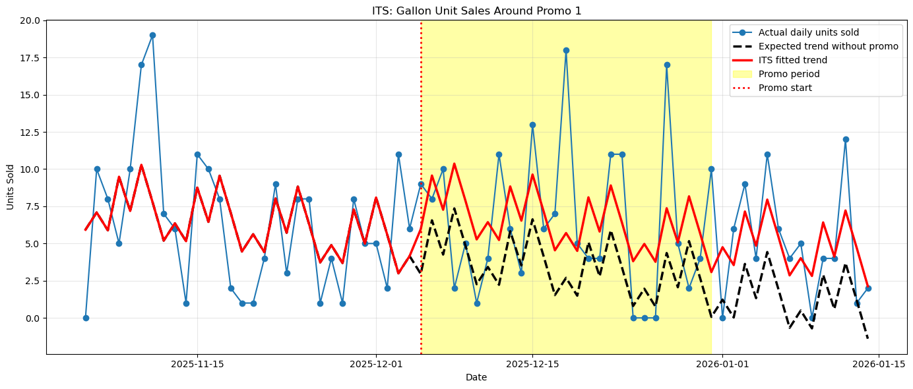
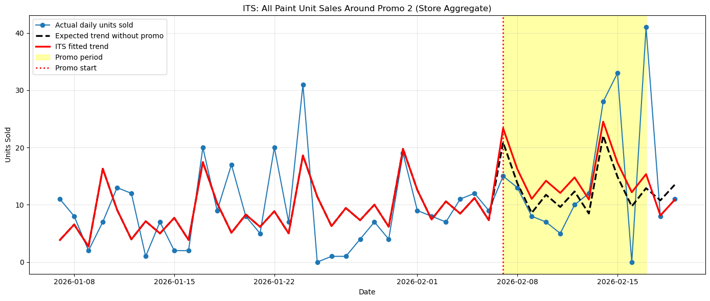

# Benjamin Moore Paint — Promotional Discount Optimizer

A causal inference and financial optimization project that evaluates whether flat 20% promotional discounts at a retail paint store generate enough incremental volume to offset the gross margin loss they create. This was a real-world project for a local store and it began as a machine learning project to predict optimal promotional discounts. Through significant experimentation, it ended up being an Interrupted Time Series project with the goal of finding out what the optimal discounts would have been for promos that already ran. 

## Project Overview

The store (Appleby North Paint, a Benjamin Moore franchise) runs promotional discounts periodically. The business question is: **Did the 2 promotional discounts that ran actually increase gross profit, and were they the optimal discounts to run during that time?**

To answer this rigorously required solving a causal inference problem: the store can't observe the counterfactual. We can't know what December sales *would* have been if no promo ran, because December always ran a promo. The solution was to build a statistical model that estimates that counterfactual and then compute the financial math on top of it.

## Data & Preprocessing

**Source:** Transaction-level data extracted using custom SQL queries on the closed DecorFusion POS system (proprietary retail management platform used by Benjamin Moore franchises).

**Size:** ~7,000 raw rows spanning approximately 14 months of sales history, filtered down to ~2,718 rows after cutting off pre-acquisition data.

**Date range:** June 23, 2025 – February 19, 2026. Data before June 23, 2025 was excluded entirely because that date marks when the new owners took over the store. Everything prior reflects a different pricing regime and customer base that would contaminate the analysis.

**Key preprocessing challenges:**

- **Retail price extraction:** The POS system stores only the price a customer was actually charged, not the listed retail price. A separate Excel file contained retail prices, but with messy lookup logic (product variants all pointed to their parent SKU rather than carrying their own price). A custom Python parser was written to resolve this.

- **Contractor pricing vs. promotional pricing:** Paint contractors automatically receive tiered discounts (10–25% off depending on account level) as part of normal B2B pricing. A gallon sold at 20% off could be either a standard contractor transaction or a genuine promotional retail event. Strict logical flags were engineered to isolate true promotional sales by cross-referencing product lines (Regal, Aura, Ben), product sizes (Gallons, Quarts, Half Pints), and the exact known promotional windows.

- **No product-line or category labels:** The DecorFusion database does not provide clean product-line or category fields at the row level. This prevented any heterogeneous treatment effect (HTE) analysis by product line; for example, separating the Aura response from the Regal response. Average costs and retail prices are used per size across all lines.

- **Features engineered:** Date/time decomposition (year, month, day, day of week), promotional flags (`Is_Promo_1`, `Is_Promo_2`, `Is_Promo`), discount percentage, and a time-trend index for the ITS regression.

---

## Promotions Analyzed

| Promotion | Window | Duration | Scope | Discount |
|:----------|:-------|:---------|:------|:---------|
| **Promo 1** | Dec 5 – Dec 31, 2025 | 27 days | Gallons only | 20% off retail |
| **Promo 2** | Feb 7 – Feb 17, 2026 | 11 days | All paint (Gallons, Quarts, Half Pints, 5 Gallons) | 20% off retail |

Promo 1 falls during the deep slow season, December is the worst month for paint sales due to cold weather and holiday closures. Promo 2 falls in early February, when painting activity begins to recover. This seasonal context is critical to interpreting the results.

## Methodology Journey

This project was built in the real world, which means the methodology evolved through several failed approaches before settling on Interrupted Time Series. Understanding why each approach was rejected is as important as understanding what was ultimately used.

### Phase 1: Machine Learning Baseline Forecaster (Abandoned)

**Plan:** Train an XGBoost regressor to predict what sales would have been without the promotion (the counterfactual baseline). Subtract actual from predicted to estimate lift. Use the observed price-volume relationship to estimate elasticity and optimize future discounts.

**Why it failed:** Paint sales are hyper-seasonal, dominated by a massive exterior summer rush and a near-dead winter. With only 8 months of sparse data, the model had no way to learn. When asked to predict a December counterfactual, it had seen exactly one December in its training data, the one that had a promotion. There was no clean signal to separate "December normally sells less" from "December sold this much because of the promo." The model would have hallucinated a baseline.

**Decision:** Abandon predictive ML entirely. Pivot to causal inference to retroactively isolate the promo effect using the structure of the data itself.

### Phase 2: Alternative Causal Models (All Rejected)

| Model | Mechanism | Why Rejected |
|:------|:----------|:-------------|
| **Difference-in-Differences (DiD)** | Use non-promoted sizes (Quarts/Pails) as a control for promoted sizes (Gallons) during the same time period | Failed the Parallel Trends Assumption. Quart and Gallon sales don't move in tandem, they serve fundamentally different customer bases (DIY retail vs. professional contractors). |
| **Year-in-Difference (YiD)** | Compare Promo 2 this year to the exact same weeks last year | Data sparsity. Only 8 months of data means "last year" doesn't exist in the dataset. |
| **Bayesian Structural Time Series (CausalImpact)** | Use Bayesian inference to model the counterfactual | Without synthetic controls (which DiD failure eliminated), CausalImpact defaults to a purely time-based ARIMA-like forecast which would be doing the same job as ITS but inside a complex Bayesian black box using MCMC simulations. No added value; high added complexity. |

### Phase 3: Interrupted Time Series (ITS) — The Final Model

ITS became the chosen engine. The core idea: fit a regression on the pre-promo period to learn the underlying time trend and controls, then estimate how much the promo window deviated from what that trend would have predicted. The gap is the causal lift.

Promo 1 ITS

Promo 2 ITS

### Results

**Gross Profit Lift**

| Promo | Size | Daily Baseline GP | Daily Promo GP | Daily Incremental GP | Total Incremental GP |
|:------|:-----|:-----------------|:--------------|:--------------------|:--------------------|
| Promo 1 (27 days) | Gallon | $160.63 | $177.41 | +$16.78 | **+$453.05** |
| Promo 2 (11 days) | Gallon | $220.93 | $279.58 | +$58.65 | **+$645.18** |
| Promo 2 (11 days) | Quart | $51.89 | $45.46 | –$6.43 | **–$70.78** |

Promo 1 was directionally positive but statistically uncertain (p = 0.197 on the lift). Promo 2 Gallons showed a strong, statistically significant lift (p = 0.003). Promo 2 Quarts were the key diagnostic finding: the demand response was too small to overcome the margin compression from the 20% discount, making the Quart portion of the promotion a net negative.

**Optimal Discount (SciPy Optimization)**

Using price elasticity of demand (PED) estimated from the ITS lifts, a SciPy optimizer finds the discount that maximizes gross profit. Three scenarios are run per promo using the lower, point estimate, and upper bounds of the ITS confidence interval.

| Promo | Scenario | Optimal Discount | Total GP |
|:------|:---------|:----------------|:---------|
| Promo 1 — Gallon | Lower CI (pessimistic) | 0% | $4,337 |
| Promo 1 — Gallon | **Point estimate** | **20.8%** | **$4,791** |
| Promo 1 — Gallon | Upper CI (optimistic) | 37.2% | $11,841 |
| Promo 2 — Gallon + Quart | Lower CI | 0% | $3,001 |
| Promo 2 — Gallon + Quart | **Point estimate** | **26.4%** | **$3,647** |
| Promo 2 — Gallon + Quart | Upper CI | 33.9% | $5,256 |

*Actual 20% result: $4,790 (Promo 1) and $3,575 (Promo 2).*

For Promo 1, the 20% discount was almost exactly the theoretical optimum, the store got the pricing right without formal analysis. For Promo 2, a slightly higher discount in the 25–27% range would have been more profitable, driven primarily by the strong Gallon demand signal.

### The "Static Elasticity" Limitation

A critical caveat: PED estimates from December and February cannot be reliably applied to other months. If the February PED were used to optimize a July promotion (when contractors are desperate for paint and highly inelastic), the optimizer would recommend a deeply discounted event that would destroy margin. Seasonal elasticity variation is not captured with 8 months of data covering only two promotional events. The optimizer is valid for stress-testing the observed promotions and is not a deployable forecasting tool.

---

## Key Conclusions & Business Takeaways

1. **Promo 1 (December Gallon discount):** Generated approximately $453 in incremental gross profit over 27 days. This is positive but statistically uncertain (p = 0.197). The 20% discount happened to be almost exactly the theoretical optimum. The result is best described as "probably helpful, but not provably so with 27 data points."

2. **Promo 2 (February all-paint discount):** Generated $645 in incremental Gallon GP over 11 days — a statistically significant result (p = 0.003). **The Quart discount was counterproductive**, costing $71 in margin with no meaningful demand response. The net result (+$574) would have been better without Quart participation.

3. **The 20% flat discount is a defensible but not optimal policy.** For Gallons, it was at or near the mathematical optimum in both promos. For Quarts, any discount is likely margin-destructive at current demand elasticity levels.

4. **Store-wide flat discounts are blunt instruments.** Applying the same discount to all sizes regardless of their individual elasticity profiles leaves money on the table. A Gallon-only Promo 2 at 25–27% off would have outperformed the actual store-wide 20% event.

5. **Post-promo cannibalization is inconclusive.** Promo 2 showed a directionally negative post-promo coefficient (suggesting some pull-forward purchasing by contractors), but statistical noise prevents any firm conclusion. Promo 1 showed a Halo Effect (positive post-promo trend), though also insignificant. Neither result is reliable enough to incorporate into the financial model.

---

## Limitations & Future Scaling

### Current Constraints

- **8-month dataset.** Cannot learn year-over-year seasonality. ITS baselines are estimated from short pre-promo windows.
- **Two promotional events.** Elasticity estimates are calibrated from single observations per promo. No cross-seasonal comparison is possible.
- **No product-line labels.** Aura, Regal, and Ben have meaningfully different price points and customer profiles. Aggregating to "Gallon" averages across all three obscures potentially important heterogeneity. With more dense data HTE would have been possible.
- **No redemption rate tracking.** The model assumes all units sold during the promo window were sold at the promotional price. In reality, some transactions during the promo window (especially contractors on account pricing) may not reflect the promotion.

### When More Data Is Available

1. **Replace ITS baseline with Prophet or SARIMAX** to natively handle annual seasonality and produce more accurate counterfactuals with quantified uncertainty.
2. **Heterogeneous Treatment Effect (HTE) analysis by product line** — separate elasticity estimates for Aura, Regal, and Ben to enable line-specific discount recommendations.
3. **Re-introduce cannibalization penalties** into the SciPy objective function once the post-promo dip achieves statistical significance across multiple promotional events.
4. **Build a predictive model** Currently data constraints result in only being able to analyze past promotions. However, with more dense data, and by implementing either machine learning or a more thorough causal inference model, the optimal discount at a given time (and what product line and size to discount) can be done.

---

## Data Privacy Notice

Note: The dataset used for this analysis contains proprietary financial and point-of-sale data from a private retail business. To adhere to data privacy and confidentiality standards, the raw CSV files have not been included in this public repository. The Jupyter Notebooks have been saved with pre-calculated outputs and visualizations to demonstrate the logic and results.
